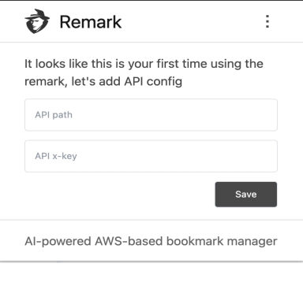
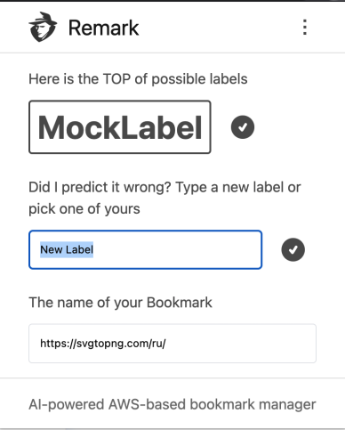

  

  

---

Remark — AI-powered AWS-based bookmark manager.

Remark can help you organize your bookmarks just in two clicks instead of scrolling long lists of possible appropriate folders in your browser.

Remark is open-sourced and fully free, but to keep your data safe Remark need to use `AWS clouds`. You need to have an `Amazon` account to deploy backend part of Remark.

## Ecosystem

| Project                                                                       | Status                                                                                                                                        | Description                                                                               |
| ----------------------------------------------------------------------------- | --------------------------------------------------------------------------------------------------------------------------------------------- | ----------------------------------------------------------------------------------------- |
| [remark-aws-backend](https://github.com/vtcaregorodtcev/remark-aws-backend)   |   | Backend part of Remark extension. Allows to save all created bookmarks and classify them. |
| [remark-telegram-bot](https://github.com/vtcaregorodtcev/remark-telegram-bot) |                                                                                    | Mobile client of Remark based on telegram messanger. Have the same functionality.         |

## Usage

This project in under development now and will be not available in Chrome Web-Extensions Store for some time, but this is not prevent you from using Remark right now. See next paragraph.

## Development

You can participate in development of this tool.

This project is using [`SolidJs`](https://www.solidjs.com/) as the main UI framework. For managing dependencies Remark is using `PNPM` package manager.

In order to start application just in browser not as extension, install dependensies [`pnpm install`] and just run [`pnpm start`]. It will run local dev server on `localhost:1234` and applying <b>`mocks`</b>.

To run this project as an extension, run [`pnpm build`] and follow [this instructions](https://developer.chrome.com/docs/extensions/mv3/getstarted/). You will be able to load sources from dist folder and use Remark as an extension.

## Flow

After everything is set up you will have to provide your `API path` and `API x-key` of your backend provided by [remark-aws-backend](https://github.com/vtcaregorodtcev/remark-aws-backend)

  
  &nbsp;
  

Since all info about api will be provided every click on extension icon will create a new bookmark and Remark will try to predict it's label/folder. Of course if it's wrong prediction you still have ability to specify your own name or pick from exists.
